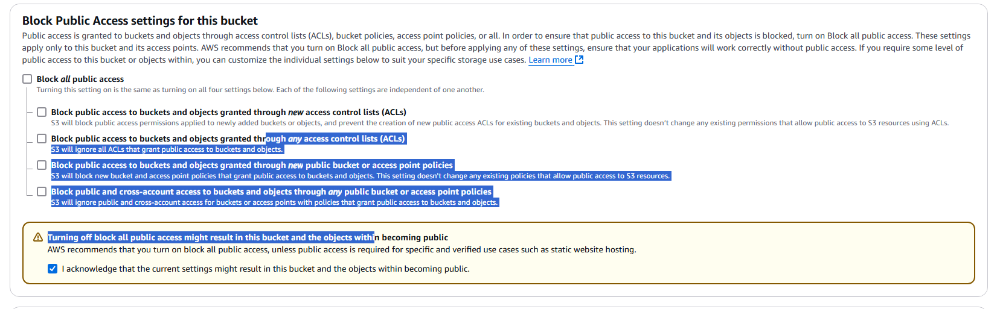
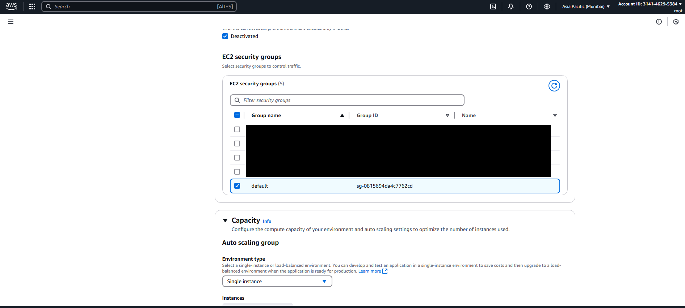
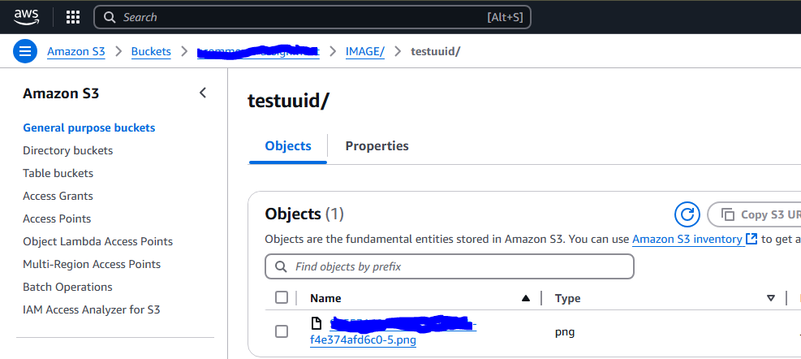

# Ecommerce AWS Assignment

## Description
This E-commerce application is a Spring Boot-based system designed to manage products, place orders, and manage sellers. The application uses AWS services like RDS database, Elastic Beanstalk, and S3 Bucket to store data and runs within an AWS environment for ease of deployment and configuration.

## Requirements
- Java 17 or higher
- Maven 3.8.1 or higher
- AWS Account with access to:
  - Amazon RDS (MySQL)
  - Amazon S3
  - AWS Elastic Beanstalk
  - IAM for security credentials
- GitHub account for CI/CD


## Developer Instructions
To run the application, follow the instructions below:

1. Clone the repository:
   ```bash
   git clone https://github.com/Yashika1410/ecommerce-aws.git
   cd ecommerce-aws
   ```
2. Set Up the AWS Environment
    The project uses AWS Services to upload images and manage data. Follow the steps below to initialize the application:
    * Login to the AWS console. Now first we need to create an S3 bucket.
            Search for the S3 on the top search bar. And Once you open the page click on create Bucket.
            
    * After clicking on Create Bucket A portal will open up. In which we need to fill the details Like bucket name and Enable the ACLS. The page will be look like this:
        
    * After This disable all the Block public access check boxs and check the last one.
        
    * Reset keep all the things as same and click on create bucket.
        
    * Finally your bucket is created.
        
    * Copy the buckect name and bucket URL which will be used to configure the application.
    
    * Now create the RDS Database for data storage. Search for RDS on the console.
        
    * Click on DB instances to create new RDS instance. Then a form will open select Easy Create and MySQL as database.
        
    * Then select for free trail and select for self managed password and populate the passwords.
         
    * Copy and paste the username and password in a notebook because those are required in the application.
    * Then keep all the things as default and create the database. After creation a window like this will open. 
        
    * After successfull creation open it and copy the url and paste it in the same notebook.
        
    * Now we need to create a user for the application. So that application can upload the images to the S3 bucket.
    *  Search for IAM on the console and select the IAM.
       
    * Now on the left side select users.
        
    * Click on create user and a form will open then populate the name of the user. Then click next.
        
    * Then a permission tab will open in which select attach policies and select given below permissions policies. So that we can use it for file upload and in CI/CD pipelines as well.
    Permissions:
        ```
            * AdministratorAccess-AWSElasticBeanstalk
            * AmazonS3FullAccess
        ```
        
        
    * Click on next and a review page will be open.
        
    * Click on create and create the user. Once the user got create click on it and user details page will open then click on create access key.
        
        
    * A page will be open to provide details for the access key. Now select third party services because this access key is going to be used at multiple places. And click on I understand and click next.
        
    * On the next screen provide the description and create the key. Once it got created copy Access key and Secret value and paste it in the notebook.
        
    * Now go back to the IAM and select the roles on the left side same as Users.
        

    * Click on Create role and a window will appeare in which we need to select Aws services and service/use case as EC2. Then click Next.
        
    * Now select the given below permissions policies.
        Permission Policies:
        ```
          *  AWSElasticBeanstalkEnhancedHealth
          *  AWSElasticBeanstalkMulticontainerDocker
          *  AWSElasticBeanstalkWebTier
          *  AWSElasticBeanstalkWorkerTier
          *  CloudWatchFullAccess
        ```
        
    * Now populate the role name, description and tags and create the role.
        
        
    (I missed one permission. Attaching the update ss below)
        

3. Build and deployment using github ci/cd.
    * Go to AWS console and open Elastic bean stalk and click on create environment.
        
    * Fill details like application name, env name and select platform as java and versiona as 17. Select Application code as sample application. Then click on next.
        
    * Now configure service page will be open and select create and use new service role or use existing service role. Then select EC2 instance as the role which created on IAM Role page.
        
    * Set-Up networking and database page will open. Now select the same VPC as RDS database vpc. Then select Public IP address and select all instance subnets and database subnets. Keep all the settings as default and click next.
        
        
    * On the next screen select security group like default or if there is any existing security group then select. Then keep everything default and click on next.
        

    * On the next screen select Enhanced Monitoring System. After that select metrics like 2xx,3xx,4xx,5xx. And provide the email for notifications.
        
        
    * At the end add all the environmemt properties as given below. (Now values those will be required which earlier copy pasted in the notebook).
        
    * Review the configurations and create the application.
    * After creation wait for the deployment.
        
    * Now you have two options: either build the JAR file of the project and upload the application manually, or upload the project to GitHub and populate the secrets in the repository settings.
    * Lets start with github ci/cd. Follow  below steps to use github workflows.
        * open the project in any IDE.
        * open <a href="./.github/workflows/build_and_deploy_service.yml">build and deploy</a> workflow. Past the application and environment name in the workflow so that it can deploy the jar on the EBS.
        
        * Now populate the secrets on the github repository. Open the github and the repository and click on the settings.
        
        * Now on the left click on secrets and variable. Under it select actions. Then create New Repository secret. Populate the values using that notebook as given below.
        
        * Now push the code on the dev branch and raise a PR to master a workflow will get trigger to test the code.
        
        
        * If the test is passed then merge the code to trigger the build and deploy workflow.
        
        
        * After this workflow got succes. Open the AWS and check the EBS's deployment. And test the application deployed successfully or not by using given below link.
        {baseUrl}/swagger-ui/index.html
        ##### Note: Replace the baseUrl with EBS's url and test the instance.
        A swagger doc will be get open.
         
        * Test the application by making multiple calls and verify S3 functionality by uploading data using the CURL command below (Note: Make sure to select form-data under body section in Postman to avoid crashes):
        ```bash
        curl --location 'baseUrl/api/v1/files' \
        --header 'Accept: */*' \
        --form 'uuid="testuuid"' \
        --form 'files=@"/path/to/file"'
        ```
        
        * By clicking on the response link you can access the image and also you can check the s3 that this file got uploaded or not.
        
        (To visualize image in postman use <a href="image-visualizer.js">script</a>)
        
    * Now check the EBS's oveall health. to check logging metric is working ot not.
        
        
    Working fine Nice 😄


